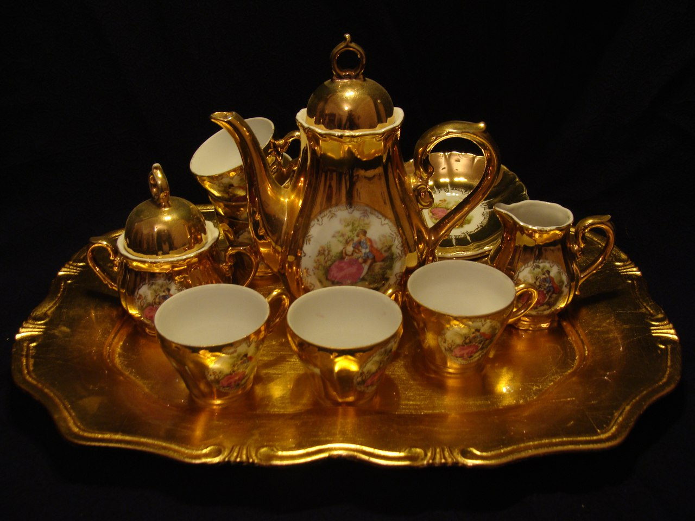
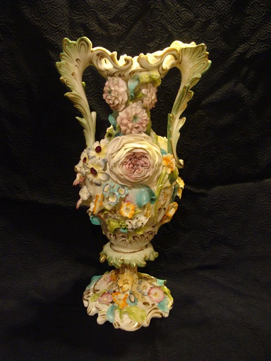
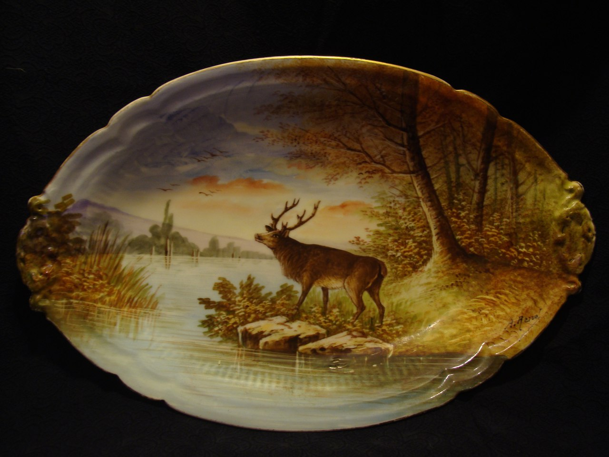
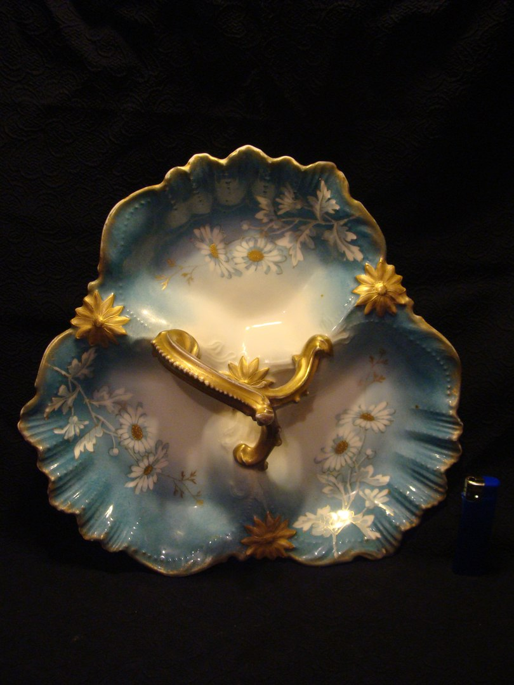
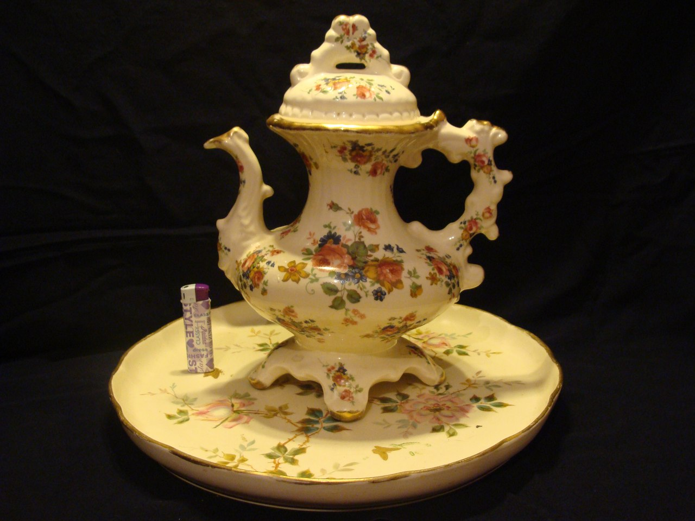

<html>
<head>
<meta charset="utf-8">
  <title>CHERDANTIQUE</title>
  <link rel="shortcut icon" href="ch.ico" type="image/x-icon">
</head>
<body>
 <h1>Антиквариат из Европы</h1>
<body>
<ul>
 <td  align="center" width="60" height="60" >
 

 <li>💫Антикварное панно"Женщина"💫</li>
<li>👌Франция, 19 век</li>
<li>👑Латунь ,Фарфор, Чеканка</li>
<li>📐Диаметр 40 см</li>
<li>🔶Цена 18000 рублей</li>

<td>

 </td>
 <body>
 <ul>
  <td  align="center" width="60" height="60" >
  
<li>💫Кофейный сервиз💫</li>
  <li>👑Фарфор. Золочение</li>
  <li>❕Клейма нет</li>
<li>👌Вероятно Германия</li>
<li>📐Высота чайника 25 см, кружки 5,5 см</li>
<li>📐Диаметр кружки 6,5 см, блюдца 12 </li>
<li>🔵Поднос пластиковый, диаметр 42см</li>
<li>🔶Цена 5000 рублей</li>

</td>
</ul>
   
  <ul>
  <td>

 </td>
 
<li>💫Старинная антикварная ваза "Цветы"💫</li>
 <li>📐Высота 31 см, ширина по ручкам 15 см</li>
 <li>👌19 век</li>
 <li>🔶20 000 рублей</li>
 

  
 <td  align="center" width="60" height="60" >

 </td>
  </ul>
  
 <ul>
 <td>
 </td>
 
<li>💫Французское Блюдо💫</li>
 <li>📝Ручная роспись</li>
 <li>🎁Лимож</li>
 <li>📐Размеры 41х27 см</li>
 <li>🔶Цена 28000 рублей</li>
 

  
 <td  align="center" width="60" height="60" >

 </td>
 </ul>
  
  <ul>
 <td>
 </td>
 
<li>💫Менажница💫</li>
 <li>📝Полностью ручная роспись</li>
 <li>🎁Лимож</li>
 <li>👌Франция</li>
 <li>👑Фарфор</li>
 <li>📐Диаметр 28 см</li>
 <li>🔶Цена 16000 рублей </li>
 

  
 <td  align="center" width="60" height="60" >

 </td>
 </ul>
  
  <ul>
 <td>
 </td>
 
<li>💫Кувшин под воду💫</li>
 <li>🎁Лимож</li>
 <li>👌Англия. Staffordshire</li>
 <li>👑Фаянс</li>
 <li>📐Высота 30 см</li>
 <li>🔶Цена 4100 рублей</li>
 

  
 <td  align="center" width="60" height="60" >

 </td>
 </ul>
  
 

 
 
Свяжитесь с нами, если запланировали какую-либо покупку:
 

  
 <body>
  
<b>Задайте вопрос вот здесь:</b>

  
<form method="POST" id="feedback-form">
Как к Вам обращаться:
<input type="text" name="nameFF" required placeholder="фамилия имя отчество" x-autocompletetype="name">
Email для связи:
<input type="email" name="contactFF" required placeholder="адрес электронной почты" x-autocompletetype="email">
Ваше сообщение:
<textarea name="messageFF" required rows="5"></textarea>
<input type="submit" value="отправить">
</form>

  
  
  
  
 <body>
 <h1>Посетите наш instagram >>></h1>
</body>
 

<html>
</html>

