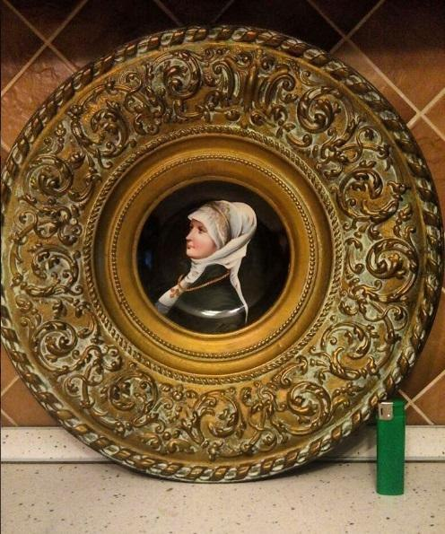

<html>
<head>
<meta charset="utf-8">
  <title>CHERDANTIQUE</title>
</head>
<body>
 <h1>Европейский антиквариат</h1>

ANTIK

 <td  align="center" width="100" height="100" >

 </td>
 
</body>
</html>

