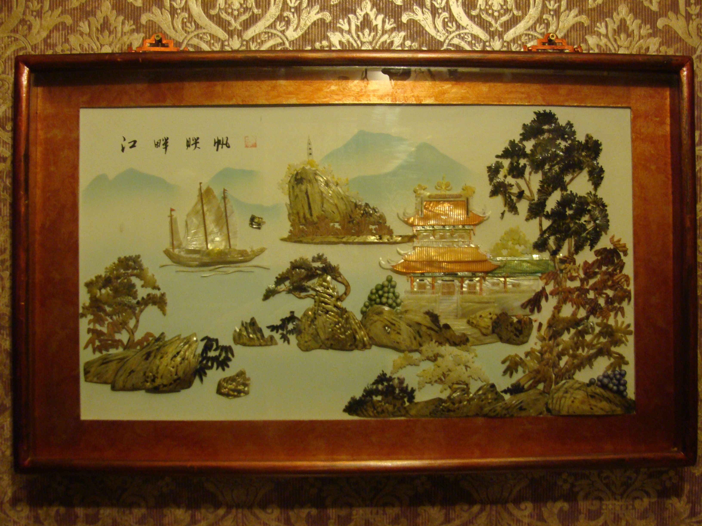

<html>
<head>
<meta charset="utf-8">
  <title>CHERDANTIQUE</title>
</head>
<body>
 <h1>Европейский антиквариат</h1>

ANTIK

 <table border="1" cellspacing="4" cellpadding="12">
<tr>
<td  align="center" width="78" height="102" >

 </td>
</tr>
</table>
</body>
</html>

